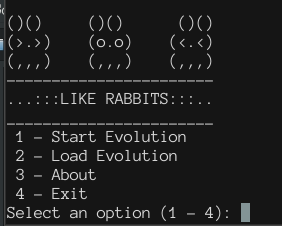
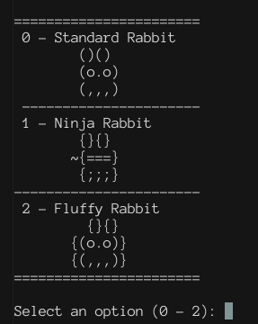
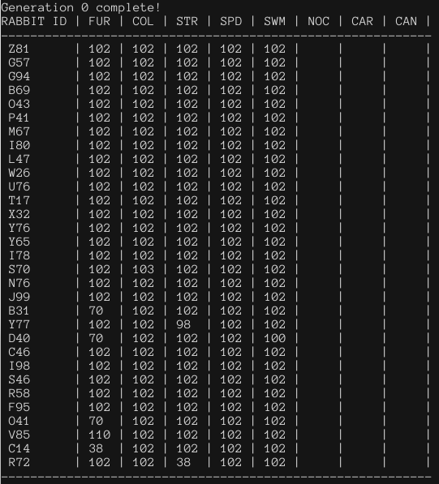

# Like Rabbits
At its core, this is a Genetic Algorithm  
It uses rabbits to simulate evolution to best fit their enviorment  

## Current Features
- Two premade rabbits (Ninja and Standard)  
- One premade enviorment (Standard Enviorment)  
- Three different special traits that will randomly mutate  

## What Doesn't Work
- Loading a previous Evolution 
- Custom Rabbits / Enviorments
- Clean Output (how it outputs now is useful for debugging)  
- Generation Logs
- Cannibalism Trait does not work properly (doesn't crash, but it doesn't work)

## TODO
- Fix Cannibalism
- Fix the 1 second delay for each rabbit being generated (easy fix)
- Rework the surival odds .. Specifically on...
	- Temperature 
	- Predator Noticing the rabbits
- Add more enviorments
- Add ability to create custom enviorments / rabbits

## HOW TO COMPILE
> g++ ./src/driver.cxx ./src/rabbit.cxx ./src/enviorment.cxx -o rabbits  
run with...  
> ./rabbits  
(Assuming GNU/Linux Distrobution)

## PICTURES!
Main Menu   
  

Rabbit Selection   
  

DNA Chart  

